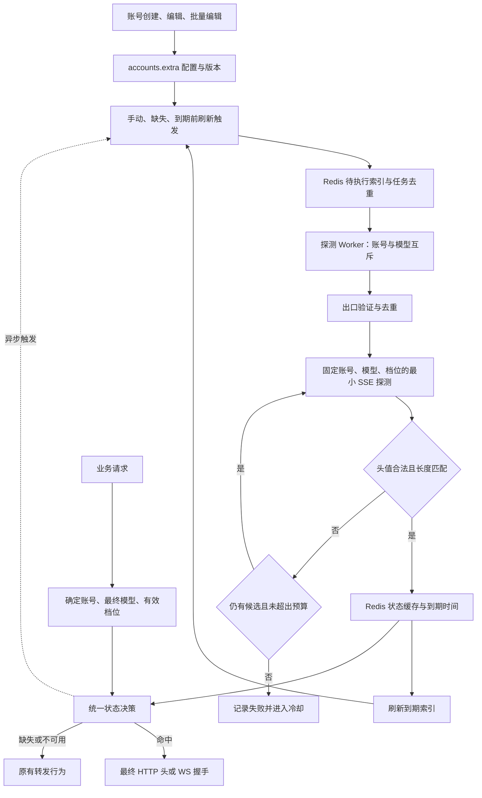

# OpenAI 上游会话状态探测、缓存与自动注入技术方案

| 文档属性 | 内容 |
| --- | --- |
| 状态 | 已批准并实施；使用及验证范围见 `openai-turn-state-implementation.md`；未发起真实上游探测 |
| 适用项目 | sub2api，架构核对基线 `4726bdd08` |
| 适用账号 | 显式开启本功能的 OpenAI OAuth 账号 |
| 筛选特征 | `x-codex-turn-state` 的完整字段值长度默认等于 `292` |
| 缓存策略 | 默认有效 `3600` 秒，在存活满 `3000` 秒时发起刷新 |
| 核心流程 | 出口链路探测 → 特征长度筛选 → 账号、模型、档位隔离缓存 → 业务请求自动注入 → 到期自动刷新 |

## 1. 目标、边界与关键决策

目标是在多出口代理环境中，复用符合指定长度特征的上游状态，减少重复探测与不必要的上游交互，为转发稳定性和调度效率提供可观测、可回退的优化机制。

`292` 是本系统选择的长度特征，不代表官方验证的“不降智状态”、模型能力等级或请求成功保证。`3600` 秒是本系统管理缓存的有效时长，不是 OpenAI 对该字段的官方有效期承诺。控制台统一使用“匹配长度特征”“缓存可用”“本地缓存剩余时间”等表述。

本方案作出以下明确决策：

1. **共享范围固定为账号 ID、最终上游模型、有效服务档位。** 同一组合下，不同用户、线程、会话共用一份缓存状态；不把用户 ID、API Key ID、会话 ID、出口代理 ID加入共享缓存键。
2. **状态内容是上游生成的不透明值。** 不解析业务语义，不截断、补全、拼接、改写或自行生成；仅作合法头值检查、长度检查和摘要计算。
3. **有效缓存优先于客户端历史值。** 客户端回带值及已有兼容桥会话状态不能覆盖有效共享缓存。
4. **缓存不决定账号选择。** 查询发生在账号选择、模型映射、档位调整之后；一期不以缓存命中或探测结果改变账号评分、权重、业务代理或业务重试策略。
5. **探测是后台工作。** 缓存未命中、Redis 故障、刷新失败均不要求业务请求等待多节点探测。
6. **共享状态不等于共享上下文。** 保留现有用户隔离、会话标识、执行作用域和续链规则；不为复用状态而改写 `previous_response_id`、用户对话或工具历史。
7. **跨出口、跨线程及跨会话有效性均为待验证假设。** 长度匹配不证明状态与出口、设备、线程无绑定关系；实际收益及适用账号需经后续灰度实测确认。

## 2. 与当前架构的衔接

仓库已存在以下相关能力，应在这些能力上扩展，避免建立相互竞争的注入路径。

| 当前模块 | 已核对的行为 | 本方案衔接方式 |
| --- | --- | --- |
| `backend/internal/service/openai_codex_turn_state.go` | 对客户端回带值进行账号来源校验；真实响应提交时记录来源；延迟提交响应避免提前污染来源记录 | 保留响应提交语义；新增明确的状态来源和共享缓存决策，区分客户端值、会话回放值、探测缓存值 |
| `openai_gateway_forward.go`、`openai_gateway_passthrough.go` | 分别构建普通、自动透传出站请求，已有身份处理和 routing hint 生成 | 在最终请求体、身份配置与请求头收敛后执行统一注入 |
| `openai_routing_hint.go` | 按最终模型和规范化档位生成 `x-codex-routing-hint` | 复用现有生成规则；共享同一份最终路由上下文 |
| `openai_ws_forwarder_payload.go` | `buildOpenAIWSHeaders` 被连接池、WS 接入和原生透传调用 | 统一握手决策；拨号、重拨和延迟预热前再次校验 |
| `openai_ws_pool.go` | 已有握手身份兼容判断，模型路由亲和允许在容量不足时降级 | 本功能管理的连接增加模型、档位、身份版本和状态匹配硬条件，不能降级为跨状态复用 |
| `openai_ws_state_store.go`、`openai_gateway_messages.go` | 已有会话状态回放、兼容桥补头 | 回放状态保留独立来源，纳入最终优先级判断，不能冒充共享缓存 |
| `openai_codex_fingerprint.go`、`openai_codex_account_identity.go` | 指纹种子、不同指纹模式、实际凭据身份及影子账号身份解析 | 身份版本必须覆盖最终生效的稳定身份配置及凭据来源变化 |
| `backend/internal/repository/proxy_probe_service.go` | 支持出口信息探测，包括 `chatgpt-trace` 解析器 | 复用出口识别接口，补充目标链路验证、新鲜度及公网出口去重 |
| `accounts.extra`、账号管理组件 | 已支持账号扩展配置及批量修改 | 新增独立配置对象，按字段合并，运行态存 Redis |

现有 turn-state 提取函数带有 `TrimSpace`；新探测存储路径应使用独立的原值提取逻辑，不能复用会修剪值的函数来满足“完整保存”要求。

## 3. 组件与总体数据流



建议新增四个职责清晰的组件：

| 组件 | 职责 |
| --- | --- |
| `OpenAITurnStateService` | 资格判断、缓存查询、状态来源决策、最终注入及失效判断 |
| `OpenAITurnStateProbeService` | 候选出口筛选、固定探测请求、响应头采样、结果分类 |
| `OpenAITurnStateStore` | Redis 状态、任务、互斥租约、冷却、版本与原子写入 |
| `OpenAITurnStateRefreshWorker` | 扫描到期任务、限流、执行刷新、崩溃恢复和重排 |

探测服务直接使用受控上游传输接口，不经公共网关入口再次调度，避免探测递归触发探测、换号、误用业务代理或进入用户计费链路。

## 4. 控制台及配置契约

### 4.1 配置项

| 配置项 | 默认值 | 行为及校验 |
| --- | --- | --- |
| 启用会话状态探测与自动注入 | 关闭 | 按账号独立开启；后端校验平台及 OAuth 类型，不能仅由前端隐藏控制 |
| 状态探测使用的出口代理节点 | 空，多选 | 选择已有代理；启用时至少存在一个可验证的有效候选 |
| 需要探测状态的目标模型 | 空，多选 | 存储实际最终上游模型 ID；启用时不能为空，不将客户端别名直接作为缓存键 |
| 目标会话状态标识长度 | `292` 字符 | 正整数；一期支持可见 ASCII 字段值，此时字符数等于字节数；受头部大小上限约束 |
| 缓存有效时长 | `3600` 秒 | 正整数；改变该值后重新探测，不追溯延长旧记录 |
| 提前刷新阈值 | `600` 秒 | 大于零且小于缓存有效时长 |
| 单轮探测最大尝试次数 | `10` 个候选代理节点 | 一期建议校验范围 `1–10`；每个有效候选每轮至多一次上游 SSE 请求 |
| 单次探测请求超时 | `20` 秒 | 包含该候选的必要出口复核、DNS、代理连接、TLS 和响应头等待；建议可配 `1–60` 秒 |

目标模型列表内增加“有效档位”明细，用来消除手动探测时的歧义。默认选择该账号现有策略下的常规档位；如实际使用多个档位，逐项列出并逐项生成任务。禁止将模型的一个档位探测结果复制到其他档位。

本期由管理员显式选择模型及档位，不自动扩展业务请求发现的档位。未选组合保持原有转发行为；目标集合限制为最多 32 个模型、64 个模型/档位组合。

### 4.2 建议存储结构

以下为结构示意，尖括号内容由真实配置填充，不是固定模型或代理：

```json
{
  "openai_turn_state": {
    "schema_version": 1,
    "enabled": false,
    "proxy_ids": [],
    "targets": [
      { "model": "<最终上游模型 ID>", "service_tiers": ["omitted"] }
    ],
    "target_length": 292,
    "cache_ttl_seconds": 3600,
    "refresh_before_seconds": 600,
    "max_attempts": 10,
    "probe_timeout_seconds": 20
  }
}
```

`omitted` 是内部键值，表示最终出站请求没有 `service_tier` 字段，不能把该字符串发送给上游。`identity_version`、`config_version` 和失效代际由服务端管理，客户端不得自行指定。状态原文、锁和探测结果不写入 `extra`。

创建页在账号保存成功后才允许“立即探测”。编辑页使用已保存配置执行操作，未保存改动应明确提示。批量编辑使用“不修改 / 开启 / 关闭”三态及逐字段选择，未勾选项不覆写；嵌套配置逐字段合并，不替换整个 `extra`。混合账号批量操作返回逐账号适用性与失败原因。复制账号不复制状态和任务，建议新账号默认关闭本功能。

### 4.3 操作与展示

“立即探测”按指定模型、档位创建异步任务；支持选中多个目标后逐个排队。若同账号、同模型已有任务，返回现有任务 ID 或合并待执行目标，不并行启动。手动操作可绕过本功能的失败冷却，但不能绕过账号不可用、上游限流、任务互斥或集群资源限制。

“清空缓存”支持单个模型、档位或账号全部目标。原子提升对应失效代际并删除缓存、待刷新计划与待执行旧任务；取消在途旧任务，阻止其重新写回。该操作本身不发起探测；功能仍开启时，后续业务缺失或手动操作可以产生新任务。界面需说明此行为。

按模型分组、按档位分行展示：状态、匹配长度、实际探测时间、本地过期时间、剩余时长、来源代理节点、最近结果、下次允许探测时间。仅展示摘要，不提供状态原文查看或复制。

状态使用“缓存状态 + 探测状态”两条内部轴派生，避免刷新失败把可用旧值误标为完全不可用：

| 条件 | 主状态 | 补充信息 |
| --- | --- | --- |
| 无缓存、无历史结果、无运行任务 | 未探测 | 可发起探测 |
| 无可用缓存且任务正在运行 | 探测中 | 第几个候选、任务开始时间 |
| 存在未过期、版本匹配的缓存 | 可用 | 可附“刷新中”或“上次刷新失败” |
| 已有缓存历史，缓存已到期且无运行任务 | 已过期 | 可附最近失败与冷却时间 |
| 无可用缓存、最近探测失败且无已过期记录 | 探测失败 | 稳定错误码与简短原因 |

开关关闭作为单独的“已关闭”设置标识，以上五个状态仍可用于历史诊断。Redis 不可用时显示“状态暂不可读取”，不能伪报“未探测”或“可用”。

## 5. 出口识别与逐节点探测

### 5.1 候选节点约束

1. 仅从该账号配置的现有代理 ID 中选取。排除被删除、禁用、过期或协议不可用的节点。
2. 复用现有 `ProxyProbeService`，记录公网 IP、地址族、检查时间、目标及代理配置版本。优先使用与 OpenAI 目标域名路由一致的出口验证方式；检测请求不携带 OAuth 凭据。
3. 将 IPv4、IPv6 地址按规范形式归一化，处理 IPv4-mapped IPv6 的等价形式，以实际公网出口去重。代理地址、端口或代理节点 ID 不构成不同出口的证明。
4. 普通 IP 查询服务的检测结果仅作参考。若代理按目的域名分流、出口轮换或无法验证出口稳定性，标记“出口未确认”，不计为已验证的独立候选；要求配置固定或粘性出口后再使用。即便 trace 检测通过，也不能对后续动态链路作永久保证。
5. 候选预检异步完成；执行前检查新鲜度，建议五分钟，并在代理配置变更后立即失效。必要复核计入该候选的超时预算。确认出口重复后跳过，不重复向上游发起状态探测。
6. 选择不超过 `max_attempts` 个已验证不同出口，数量不足时按实际数量运行并展示“可用独立出口 X 个”。配置十个代理地址不代表有十个独立出口。
7. 不自动生成、绑定或虚构 IPv6 地址，不修改系统网络，也不补入未选代理或直连路径。探测时禁用会隐式切换出口的代理 fallback；必须明确记录实际使用的节点。

候选默认按管理员选择顺序执行；刷新可将上次成功且仍合格的节点置前，减少重复交互，其余节点保持稳定顺序。

### 5.2 探测任务快照

每个任务固定以下字段：账号 ID、实际凭据来源、最终模型、有效档位、身份版本、配置版本、失效代际、候选列表、探测模板版本、任务 ID。任务中不得换账号、自动降级模型或改变服务档位。

探测复用该账号的认证、目标地址校验、TLS 与稳定指纹配置。建立与真实用户无关的内部探测会话，不提取用户会话标识；正常客户端会话派生值和逐回合随机字段不纳入账号身份配置版本，也不为了适配缓存而强制统一用户线程。

固定最小请求示意：

```json
{
  "model": "<任务固定的最终模型>",
  "stream": true,
  "store": false,
  "instructions": "Reply with OK.",
  "input": [
    { "role": "user", "content": [{ "type": "input_text", "text": "OK" }] }
  ]
}
```

实际模板须经本项目 OAuth 上游适配器验证；仅附加该协议确实需要的字段。有效档位存在时发送准确的 `service_tier`；不存在则省略。不能盲目添加上游不接受的输出 token 限制，也不声称短提示词保证零用量。

### 5.3 执行流程

```text
领取固定账号、模型、档位任务
  → 获得账号 + 模型互斥租约，复核账号及各版本
  → 选择最多 N 个已确认不同出口的候选
  → 对每个候选：
       在 20 秒默认预算内复核出口并建立独立探测请求
       移除所有大小写变体的 x-codex-turn-state
       禁用客户端回带、共享缓存注入、WS/兼容桥历史状态回放
       发送固定最小 SSE 请求
       收到响应头后读取状态字段，立即关闭响应体并取消请求上下文
       若 HTTP 成功、字段唯一合法且长度匹配：尝试原子提交并结束
       否则记录原因，继续下一候选
  → 全部失败：保存本轮结果并进入冷却
```

成功判定要求正常最终 `2xx` HTTP 响应且符合预期 SSE 响应类型；不接受重定向、错误页、非成功 HTTP 状态中的状态头。请求不自动跟随重定向。字段缺失、重复字段、非法控制字符、非 ASCII 值或长度不匹配均不得入库。对多个字段值不做逗号拼接或任意挑选。

“完整原值”指 HTTP 库正常解析后提供的单个字段值。除协议栈自身的字段解析外，应用层不再 `TrimSpace`、解码、规范化或重编码；诊断长度与保存值必须针对同一份数据。异常值直接拒绝，不通过修改内容使其达到 292 字符。

收到响应头即关闭流，不等待首个 SSE 事件、结束事件或完整响应体。HTTP/2 下关闭的是该响应流，不应连带关闭共享业务传输连接；建议探测使用独立传输资源或明确隔离的请求取消机制。专用探测连接随后回收。

读取头后关闭流不意味着上游没有执行，也不保证没有用量。缺少 usage 时记录 `usage_unknown`，不记作已确认的零消耗，不将探测记入某个业务用户账单。能够取得的上游用量或账号额度变化用于单独核算运营成本。

一般请求失败按顺序切换下一节点。账号关闭、身份/配置变化、租约丢失、任务取消则停止；遇到 `Retry-After` 按现有上游限制延后，不用换出口绕过账号级限流。探测不得触发账号常规业务代理配置变更，也不因单纯长度不匹配将账号标为故障。

默认最多十个候选、每个二十秒，候选执行预算最多二百秒；另设置小额、明确上限的任务提交与调度开销。禁止传输层隐藏重试将十次探测膨胀成更多应用请求。

## 6. Redis 缓存、隔离与并发一致性

### 6.1 键和档位规范

逻辑缓存键为：

```text
CacheIdentity = 上游账号记录 ID + 最终上游模型 + 有效服务档位
```

账号使用本项目账号记录 ID；即使两条账号记录引用相同上游凭据，也不合并缓存。影子账号若属于允许的 OAuth 使用范围，仍以被选账号 ID 隔离，身份版本必须同时包含实际凭据父账号的稳定身份版本；父账号身份变化应使相关缓存失效。

模型使用最终规范化上游 ID，不使用计费模型、展示名称或映射前别名。档位取最终出站请求的有效值：如 `fast` 已被策略转换为 `priority`，按 `priority`；缺省字段使用内部标记 `omitted`。只有现有策略已消除差异时才合并等价输入，仍实际发送的 `auto`、`default`、`flex` 等不同值不可仅因 routing hint 相同就合并。不能从上游响应猜测档位后重新归属缓存。

建议 Redis 键结构：

| 键 | 内容/用途 |
| --- | --- |
| `ots:v1:{acct:ID}:control` | 开关、身份/配置版本、账号失效代际、同步状态 |
| `ots:v1:{acct:ID}:state:M:T` | 模型 M、档位 T 的完整状态记录，按原定到期时间过期 |
| `ots:v1:{acct:ID}:target:M:T` | 目标失效代际、探测结果、冷却、下次刷新、任务诊断元数据 |
| `ots:v1:{acct:ID}:lock:M` | 账号 + 模型的独占租约，故意不包含档位 |
| `ots:v1:{acct:ID}:pending` | 该账号去重后的待执行目标及触发来源 |
| `ots:v1:due:BUCKET` | 分桶到期索引，只用作调度提示 |

`M`、`T` 使用无歧义编码或哈希，记录内仍保存可核对的模型和档位。部署/租户命名空间置于前缀，避免共用 Redis 的环境互相污染。相同账号的控制、锁和状态处于同一 Redis Cluster hash slot，便于 Lua 原子校验；全局到期索引不能假设与它们跨 slot 原子更新。

### 6.2 状态记录

| 字段 | 含义 |
| --- | --- |
| `state` | 完整状态原值，仅后端内部可读取 |
| `account_id`、`model`、`effective_service_tier` | 显式记录隔离维度，读取时再次核对 |
| `probed_at` | 实际收到成功探测响应头的时间 |
| `expires_at`、`refresh_at` | 分别为 `probed_at + ttl`、`expires_at - refresh_before` |
| `source_proxy_id` | 实际探测使用的代理节点 ID |
| `source_egress_digest`、`egress_checked_at` | 出口诊断摘要与验证时间 |
| `state_length`、`state_digest` | 原值长度与稳定摘要，建议使用集群一致密钥的 HMAC-SHA-256 |
| `identity_version` | 账号实际身份、稳定指纹配置版本 |
| `config_version`、`account_epoch`、`target_epoch` | 配置版本与主动失效代际 |
| `generation`、`probe_task_id` | 本次成功写入版本和关联任务 |
| `probe_template_version` | 固定探测模板版本 |

原始值随 Redis state key 在到期时删除。诊断元数据可单独保留，例如七天，以展示“已过期”、最近错误及探测历史；诊断保存时间不改变状态有效期。身份版本、失效代际和任务栅栏的保留时间不能短于可能存活的旧任务，账号删除、备份恢复后不得复用旧代际。

Redis 数据读取超时或不可用时，本次按无缓存处理，后台探测也不绕过 Redis 锁运行。第一期不建立原始状态的本地 L1 缓存，减少跨实例失效复杂度。Redis 作为应用重启后的共享运行态；Redis 自身重启要保留内容需配置相应持久化。Redis 丢失状态时允许退回原流程再探测，不能承诺无持久化条件下仍保存记录。

### 6.3 TTL 及原子提交

缓存采用绝对过期时间，读取使用 Redis 时间/剩余 TTL 并结合记录版本校验。实际采样时间不能被排队时间或提交时间替代；采样后至写入前已消耗的时间必须从 Redis TTL 扣除。实现中以统一时间源及采样后的单调耗时换算，避免节点时钟漂移造成超期。

成功提交使用同 slot Lua/CAS，必须同时验证：

```text
账号仍启用且不处于配置同步中
账号及目标身份/配置/失效代际与任务快照一致
当前账号 + 模型锁仍归本任务所有，栅栏令牌有效
目标模型与档位仍被允许
采样结果未超过其有效期
```

校验通过后原子写入状态、正确 TTL、成功元数据和下次刷新时间。再幂等更新分桶到期索引；如果索引更新失败，定期对账根据账号配置和目标元数据补建。索引只能提前唤醒检查，不能作为可以注入或允许旧任务提交的依据。

读取、业务命中、普通业务响应、失败探测均不得 `EXPIRE` 续期。即使业务返回 292 字符的状态，一期也只走原有响应回传和诊断，不写共享探测缓存；312 或其他长度同理。

### 6.4 去重与任务生命周期

进程内 singleflight 只减少重复排队，真正的跨实例互斥依赖 Redis。互斥粒度为**账号 + 模型**，因此同一模型不同档位也串行运行；任务本身始终只探测一个固定档位。冷却和缓存按账号 + 模型 + 档位管理。

锁使用随机拥有者令牌、递增栅栏及有界租期；续租、释放、提交均比较拥有者。租期须覆盖任务硬截止时间并留出取消余量，不能仅凭本地 goroutine 存活认为自己仍持锁。失去租约后取消请求、停止后续候选，并禁止提交结果。旧任务不能删除新任务的锁。

多实例竞争、连续手动点击、同一时刻大量 cache miss、刷新与 miss 同时发生均合并为一个逻辑任务。执行前再读缓存和刷新时间，已被其他任务完成的工作直接结束。进程崩溃后由租约到期及持久待执行索引恢复。

一致性保证是“一个有效持有者、一份权威提交”，不是上游执行的 exactly-once 保证。网络分区或 Redis 故障切换时，已发到上游的请求可能继续执行；栅栏阻止迟到结果污染缓存，不能撤销上游已经产生的交互或用量。

### 6.5 身份变更与控制面失效

以下稳定配置改变时，提升 `identity_version` 并使旧缓存立即不再具备注入资格：实际 ChatGPT 账号/用户/组织或凭据主体、凭据父账号、指纹模式和 seed、稳定设备配置、相关 UA/身份覆写策略、TLS 身份配置及身份派生算法版本。全局身份策略变化需纳入有效版本摘要。

同一凭据主体的正常 access token 刷新不自动视为身份变化；需验证主体未变，无法确认时采取失效处理。客户端每次变化的会话 ID、thread ID、turn ID 不作为身份配置版本，否则会破坏本方案跨会话共享目标。

开关关闭、身份变更、修改筛选参数、移除目标或清空缓存时，应先建立 Redis 失效屏障，再完成配置与版本同步；期间 `control` 标记为不可注入、不可提交。数据库保存配置及服务端版本，完成后将新控制状态同步到 Redis，并通知调度与连接池。中途失败保持不可注入，后台从数据库恢复。

不能建立失效屏障时，管理接口不得返回“缓存已清空/同步已完成”的成功结果，应报告可重试的同步失败；不能只靠进程内广播宣称跨实例失效。Redis 恢复或数据恢复后先核对数据库版本再开放该账号注入。已完成最终决策并开始发送的 HTTP 请求，以及已经建立的 WS，按在途行为处理，不能追溯撤销。

候选节点列表调整可保守地提升配置版本并重新探测；账号原有业务代理调整不需要改变缓存键，仍需记录实际业务出口用于跨出口效果诊断。

## 7. 业务请求的统一注入流程

### 7.1 决策顺序

```text
保存不可变的客户端原始状态及原始请求上下文
  → 本次 attempt 选择账号并解析实际凭据来源
  → 完成模型映射、服务档位策略、身份和指纹处理
  → 根据最终路由生成 x-codex-routing-hint
  → 对原有客户端/兼容桥状态执行正确的来源校验
  → 检查本功能资格并查询账号 + 最终模型 + 有效档位缓存
       命中：移除所有大小写变体，只 Set 一个完整缓存值
       未命中：保留通过原有校验的转发行为，非阻塞提交探测意图
  → 最终一致性校验后发送 HTTP 请求或建立 WS
```

建议统一返回 `TurnStateDecision`，包含 `source=probe_cache/client/session_replay/none`、账号/身份版本、模型/档位、摘要、缓存 generation、到期时间及 miss 原因。上下游状态不得共用含义模糊的字符串变量。

查 Redis 使用短超时预算，建议十至三十毫秒量级并按部署延迟实测调整；只查询本次账号对应的缓存，不遍历候选账号。未命中使用有界后台队列登记意图，队列满或 Redis 故障只记指标，不阻塞业务，也不为每个 miss 启动无界 goroutine。

命中但到达刷新阈值时，仍注入未过期旧值，同时幂等触发刷新。模型未选中、账号非 OAuth、开关关闭不触发探测。功能关闭时走原有来源守卫和会话回放路径，不查询新增共享状态或来源存储，不覆盖头、不触发新增探测；保持原有处理语义。

### 7.2 换号、改模型和优先级

每次 attempt 从客户端原始值重新构建出站头，不修改入站 `c.Request.Header` 来保存本功能注入值。换号重试必须丢弃上一 attempt 的缓存决策；新账号命中则使用新账号值，未命中则按原有来源校验处理原始客户端值，不能沿用上一账号缓存。

同账号发生最终模型或档位调整，也必须重新查询对应键。探测任务却不能在任务内随业务重试调整目标，两者职责独立。

最终优先级为：

```text
当前账号、最终模型、有效档位的有效共享缓存
    > 原有流程中通过来源校验的客户端状态/兼容桥会话状态
    > 不携带该头
```

缓存自身使用记录内账号和身份版本校验，不能再让“客户端上一份状态的来源账号”误剥离可信缓存。反过来，也不能因当前注入了缓存，就把客户端原始状态标记为当前账号生成。

### 7.3 来源追踪与响应回传

保留 `relayOpenAICodexTurnState`、`stageOpenAICodexTurnState` 的真实响应提交点语义。只在真正向客户端提交上游响应头时记录来源；被 failover 丢弃的响应不能更新来源。

现有“下游会话 → 最近账号”的进程内表不足以准确识别不同值与跨实例请求。建议补充“值摘要 + 下游作用域 → 账号及身份版本”的 Redis 来源记录，原始值不写来源索引；摘要相同而观察到多个账号时保留候选来源或标记冲突，不采用最后写入覆盖来制造确定来源。可保留短期本地加速，未知来源维持原有处理语义，不推断为可信账号。

已有 WS/兼容桥会话回放值补充来源账号和身份版本，换号时不能把旧账号的回放值作为新账号状态。来源记录 TTL 沿用其独立会话策略，不能与共享缓存的一小时寿命混为一谈。

探测请求无下游客户端，不更新客户端来源表。共享缓存注入也不调用响应回传函数。实际业务响应返回 312 字符时，可按现有规则向客户端回传这个真实新值并记录来源，但不替换 292 缓存、不延长旧缓存寿命。上游响应不含状态头时不得从注入决策中补造响应头，并清除上次失败 attempt 暂存的残留头。

## 8. HTTP 与 WebSocket 全协议接入

| 转发路径 | 注入/校验位置 | 必须保证的行为 |
| --- | --- | --- |
| 普通 HTTP / SSE | 最终请求头，所有模型、档位、身份处理之后 | 每次 attempt 独立决策；串流与非串流共用原则 |
| HTTP 自动透传 | 透传头、认证和账号覆写全部处理完成后 | 与普通 HTTP 同优先级；白名单或后续复制不能撤销覆盖 |
| 原生 WS 透传 | 读取首个有效业务帧并确定路由后，拨上游握手前 | 握手携带当前有效值；首帧不得在握手决策前发往上游 |
| WS 连接池 | Acquire 匹配校验及 dial 前最后一次决策 | 只有握手快照匹配才作为本次共享缓存命中的连接复用 |
| WS 转 HTTP | 降级/桥接后的最终 HTTP 请求头 | 根据桥接后实际账号、模型和档位重新查询，不复制旧 WS 决策 |

普通响应、compact JSON 以及兼容桥若复用上述出站构建器，也遵守同一决策；不得借本功能修改其请求体或上下文管理逻辑。

### 8.1 连接池的硬兼容条件

保留已有账号、目标 URL、业务代理、beta features、设备/会话身份及执行作用域限制，并增加本功能的不可变握手快照：

```text
selected_account_id
identity_version / account_epoch / target_epoch
final_model / effective_service_tier
turn_state_source / state_digest
cache_generation / cache_expires_at
```

必须记录**实际发送的握手请求头**对应快照，不能使用握手响应中的新状态代替。字段计算应发生在 `HeadersFactory` 等最终头工厂完成后。预热任务、`lastAcquire`、重拨及延迟拨号也需重新验证当前决策，禁止保存旧头后无限期建连。

本功能启用时，模型、档位、身份版本和状态快照是硬条件。即使容量满、指定 `PreferredConnID` 或软路由亲和没有候选，也不能跳过校验。无匹配连接时按既有资源上限等待、回收不匹配空闲连接后建连，或走已支持的 HTTP fallback；不能无界增加连接，也不能把其他模型的连接当作命中新缓存。

使用保守的 generation 精确匹配：刷新成功即产生新代际，即使恰好收到相同原文，也不将旧连接重新标成新代际。后续如要优化相同值复用，必须单独设计并验证，不能通过修改连接元数据伪造重新握手。

### 8.2 已建立连接的生命周期

缓存刷新、到期、清空或功能关闭，都不能修改已经发送的握手头，也不因本功能强制中断已有连接。仍被原执行会话持有的连接可以继续完成自然生命周期，诊断明确记录它使用的历史握手版本，不能计入新缓存注入命中。

旧连接释放后不再分配给新会话；空闲连接及旧预热模板退休，新建连接重新走当前决策。原会话严格依赖特定连接续链时，属于既有连接的继续使用，不得包装成一次“已注入新值”的通用 Acquire。若连接已不可用，交由现有续链失败/fallback 机制处理，本功能不删除 `previous_response_id` 来强行迁移。

开启本功能的新原生透传连接绑定首帧确定的模型和档位。后续帧若切换到其他模型或档位，不能沿用旧握手宣称支持新目标：有完整转发控制能力的模式可在安全轮次边界重新建连；纯透传模式拒绝该次不兼容帧并要求使用新连接，保留已有连接完成其他合法轮次，不静默跨模型注入。若不能安全重建且保持原续链语义，则沿用既有错误处理，不更改对话历史。

因此，“到期停止注入”“关闭恢复原行为”针对后续 HTTP 最终决策和新 WS 握手；已建 WS 自然退出是明确、必须验收的例外，而非承诺瞬间消除握手中的历史值。

## 9. 刷新、冷却与故障降级

默认时间线为：

```text
t = 00:00  收到匹配响应头，保存原值
t = 50:00  到达 refresh_at，后台触发刷新；旧值仍可用
t < 60:00  刷新成功则替换并从新的实际采样时间重新计时
t = 60:00  如未刷新成功，旧值到期，后续请求停止共享缓存注入
```

刷新到期索引由多实例 worker 按固定短周期扫描，例如十五秒；到期时间本身精确，实际执行允许扫描周期和队列调度延迟并须可观测。可以对同刻任务加入不超过几十秒的调度抖动，但不能改变原定过期时间，也不能把刷新排到有效期之外才视为正常。

无业务流量时也必须按计划刷新配置目标，不能仅依赖业务请求被动触发。服务重启后从 Redis 恢复计划；漏掉的计划由数据库账号配置和 Redis 目标元数据对账恢复。功能关闭、目标移除、账号删除停止重建对应任务。

| 场景 | 处理 |
| --- | --- |
| 刷新成功 | 原子替换；使用新 `probed_at` 计算到期与刷新时间；清除失败计数 |
| 刷新失败、旧值尚未过期 | 保留旧值与原到期时间，仅更新失败结果和下次尝试时间 |
| 到期后仍失败 | 不注入旧值，按原有流程处理客户端头，冷却结束后后台重试 |
| 首次探测失败 | 记录失败与冷却，无可用值时不阻塞业务 |
| Redis 查询超时/不可用 | 本次不使用共享缓存，不运行无锁探测；已有业务转发照常 |
| Worker 崩溃 | 租约到期后重新领取，旧结果受栅栏保护 |
| 账号关闭/删除、目标移除 | 失效屏障、撤销后续任务，旧任务不能提交 |
| 上游明确拒绝所注入状态 | 仅在有明确可识别证据时隔离对应 generation 并进入冷却；不能把任意 4xx/5xx 归因于状态 |

建议失败冷却采用 `60s → 120s → 240s → 480s → 600s`，附少量抖动并持久保存；成功后重置。上游 `Retry-After` 优先于更短的本地冷却。冷却按目标执行，避免每个用户请求触发一轮探测。

为控制开销，采用有界集群 worker 配额、单账号后台并发配额和业务繁忙时让出资源的策略。第一期建议单账号最多一个正在进行的探测 HTTP 请求，不同模型任务可排队；这比账号 + 模型互斥更保守，且不改变缓存隔离维度。手动探测、首次缺失、到期前刷新共用资源预算，调度防止某一类任务长期饥饿。

本功能不新增无条件业务重放。上游是否已执行不明、SSE 已向客户端输出、WS 已进入轮次时，沿用既有重试边界，避免为状态优化额外重复执行业务。

## 10. 管理 API 契约

以下为建议接口，最终名称可按现有管理路由风格调整：

| 方法与路径 | 请求/返回语义 |
| --- | --- |
| 现有账号创建、更新、批量更新接口 | 扩展 `extra.openai_turn_state`；后端统一校验、版本管理及增量合并 |
| `GET /api/v1/admin/accounts/:id/turn-state/status` | 返回按模型、档位分组的脱敏状态、剩余 TTL、任务及冷却信息 |
| `POST /api/v1/admin/accounts/:id/turn-state/probe` | 接收已配置模型/档位及幂等标识；返回 `202`、任务 ID、queued/running/joined 状态 |
| `GET /api/v1/admin/accounts/:id/turn-state/tasks/:task_id` | 返回候选计数、结果与错误码，不返回原始头或原始异常报文 |
| `DELETE /api/v1/admin/accounts/:id/turn-state/cache` | 接收明确目标范围；建立失效屏障后返回清除数量及新代际，不以物理 DEL 次数替代成功语义 |
| `POST /api/v1/admin/accounts/turn-state/probe-batch` | 可选批量操作；限定目标数、异步逐账号入队，返回逐项结果 |

接口复用现有管理员鉴权、操作审计和幂等机制。错误码建议包括 `disabled`、`invalid_account_type`、`model_not_selected`、`egress_unverified`、`no_distinct_egress`、`state_missing`、`state_length_mismatch`、`state_header_invalid`、`probe_timeout`、`upstream_http_error`、`identity_changed`、`lease_lost`、`cache_unavailable`。

## 11. 代码改造范围与建议分工

以下为改造范围；实际落地模块及验证结果见实施说明。

| 层次 | 文件/模块 | 改造内容 |
| --- | --- | --- |
| 新增领域服务 | `backend/internal/service/openai_turn_state_service.go`、`openai_turn_state_probe.go`、`openai_turn_state_refresh.go` | 配置、路由上下文、决策、探测模板、任务和刷新 |
| 新增 Redis 实现 | `backend/internal/repository/openai_turn_state_cache.go` | 缓存、控制代际、Lua/CAS、租约、冷却和到期索引 |
| 状态来源 | `backend/internal/service/openai_codex_turn_state.go` | 原始客户端值与缓存值区分、来源精确校验、提交点回传 |
| 普通 HTTP/透传 | `openai_gateway_forward.go`、`openai_gateway_passthrough.go`、`openai_gateway_response_handling.go` | 最终出站接入、每次 attempt 重新决策、保持真实响应语义 |
| 兼容入口 | `openai_gateway_messages.go` 及共用出站构建器的入口 | 确保旧会话回放不覆盖缓存，来源账号一致 |
| WS 握手 | `openai_ws_forwarder_payload.go`、`openai_ws_forwarder_v2.go`、`openai_ws_forwarder_ingress.go`、`openai_ws_v2_passthrough_adapter.go` | 最终模型/档位确定后注入，重拨及原生透传边界 |
| WS 池与桥接 | `openai_ws_pool.go`、`openai_ws_state_store.go`、`openai_ws_http_bridge.go` | 硬兼容快照、预热失效、历史来源、HTTP fallback 重新查询 |
| 身份生命周期 | `openai_codex_fingerprint.go`、`openai_codex_account_identity.go`、账号及凭据更新入口 | 身份版本、父账号变更、关闭和清空的同步屏障 |
| 代理服务 | 现有 `ProxyProbeService` 与代理元数据缓存 | 出口验证、新鲜度、地址归一化、候选去重及指定出口不回退 |
| 管理后端 | `backend/internal/handler/admin/account_handler.go`、新增管理 handler、`backend/internal/server/routes/admin.go` | 配置验证、状态/探测/清理接口及审计 |
| 前端 | `frontend/src/components/account/CreateAccountModal.vue`、`EditAccountModal.vue`、`BulkEditAccountModal.vue` | 公用配置组件、三态批量编辑、保存与操作语义 |
| 前端 API 与展示 | `frontend/src/api/admin/accounts.ts`、`frontend/src/views/admin/AccountsView.vue`、账号类型与中英文文案 | 按模型/档位状态、异步任务、错误与 TTL 展示 |
| 依赖装配 | service/repository wire provider、`backend/cmd/server/wire.go`、启动/关闭生命周期 | Redis 服务注入、worker 启停、取消和资源回收 |

配置及服务端版本优先使用现有 `accounts.extra`，不为本功能把完整状态持久化到账号表。是否需要数据库迁移取决于最终配置版本/同步任务持久化实现；不能预先把“无需任何迁移”作为实施保证。

## 12. 诊断、指标与成本评估

诊断日志记录：`task_id`、账号 ID、最终模型、有效档位、身份/配置版本、代理节点 ID、出口摘要、状态长度、短摘要、候选序号、HTTP 状态、结果码、耗时、缓存 hit/miss 原因、剩余 TTL、状态来源、WS 握手 generation 和复用/退休原因。

常规诊断仅记录状态长度和摘要。根据后续明确提出的原值日志需求，增加独立账号开关 `log_response_values` 和环境变量 `OPENAI_TURN_STATE_LOG_VALUES=true`；开启时仅将上游实际响应头的完整 `x-codex-turn-state` 写入 INFO 日志，不将注入值伪装为响应值。仍不得记录 OAuth token、其他认证头、代理 URL 中的凭据、代理密码、用户提示词、文件或工具历史。使用结构化错误码清理传输错误；管理 API 仅返回短摘要。

建议指标包括：

- 共享缓存命中率、未命中原因、Redis 决策耗时；
- 探测任务数、每轮尝试数、长度分布、独立出口数量、成功率和耗时；
- 刷新延迟、临近到期仍无成功刷新数、冷却拦截数、去重合并数；
- WS 因状态或模型不兼容而新建、等待、fallback、退休的次数；
- 业务首响应/首 token 延迟、错误率、重试率、连接重建率，以及探测交互量。

Prometheus 等时序指标避免将状态摘要、任务 ID、任意模型输入和全部账号 ID作为无界标签；详细维度放诊断日志或有界聚合。

默认约每五十分钟成功刷新一次，因此稳态每个账号、模型、档位组合每小时约 `1.2 × 平均成功前尝试次数` 次探测交互，另加首次初始化、失败重试与人工触发成本。十节点全部超时的一轮最多约二百秒候选执行时间。是否降低总交互和资源开销，需要把探测成本、Redis 查询和 WS 硬分桶导致的新增连接一并纳入对照。

## 13. 第一阶段验收：本地模拟上游

使用本地 HTTP/SSE 和 WS 模拟上游、可控代理/出口信息接口、真实 Redis 及至少两个网关实例。测试头使用明确标注的虚构测试数据，禁止混入生产缓存；测试出口 fixture 只模拟检测结果，不生成公网 IPv6。使用可控时钟或短测试 TTL验证边界，不等待真实一小时。

| 编号 | 场景 | 验收断言 |
| --- | --- | --- |
| A01 | 节点一返回 312，节点二返回 292 | 前者不入选；后者逐字节完整保存；后续节点没有被调用 |
| A02 | 缺头、重复头、非法字符、错误 HTTP、重定向、错误内容类型 | 均不入库；原因明确；一般失败继续下一节点 |
| A03 | 292 头返回后 SSE 永不结束 | 不等待 body 即保存并关闭流；业务资源不受探测取消影响 |
| A04 | 多节点超时或失败 | 不超过配置候选数及每次超时；无隐藏重试、直连回退或业务代理改写 |
| A05 | 十个地址实际只有三个公网出口 | 只认可三个独立出口；重复地址不产生额外状态请求；动态/未知出口标记正确 |
| A06 | 两个账号、两个模型、多个档位 | 任意维度变化均不交叉读取；同上游凭据的不同账号行仍隔离 |
| A07 | 模型映射与 fast/priority 等档位策略 | 探测、缓存键、routing hint、最终请求体使用同一最终上下文；不同实际档位不错误合并 |
| A08 | 多用户、多 API Key、多线程请求同一组合 | 命中同一份共享状态；原有会话/执行作用域仍隔离，body 不被本功能修改 |
| A09 | 客户端携带旧值、WS/兼容桥也有回放值 | 有效共享缓存最终覆盖；无有效缓存则遵循原有来源校验及优先级 |
| A10 | A 账号失败切换 B | B 命中时使用 B；B 未命中时绝不残留 A 注入值；原始入站头未被污染 |
| A11 | 业务响应返回 312，或返回新的 292，或缺少头 | 均不写共享缓存、不续期；仅真实响应值按原逻辑回传；无响应头时不补造 |
| A12 | 多实例并发 miss、手动探测与刷新竞争 | 同账号、同模型最多一个有效任务；不同档位串行；重复触发返回合并状态 |
| A13 | worker 崩溃、租约丢失、迟到任务写回 | 新持有者可恢复；旧持有者不能提交或删掉新锁；记录取消及恢复 |
| A14 | 五十分钟触发刷新且成功 | 无需业务请求也能触发；成功后替换并按实际采样时间重算 TTL |
| A15 | 刷新失败至六十分钟边界 | 原值保留至原期限；边界之后不注入；诊断仍显示已过期与失败原因 |
| A16 | 高频 miss 与失败冷却 | 冷却期不重复执行整轮探测；队列有界；业务不等探测完成 |
| A17 | 普通 HTTP 与自动透传 | 相同账号/模型/档位下出站头行为一致；大小写变体不会产生多个状态头 |
| A18 | 原生 WS 握手 | 首帧确定目标后握手携带正确缓存值；响应回传使用真实握手响应头 |
| A19 | WS 池相同状态、旧状态、不同模型/档位 | 匹配才按新命中复用；容量满及 PreferredConnID 均不能绕过硬条件 |
| A20 | WS 刷新、到期、清空与延迟预热 | 已建连接不强制断开；新连接使用当前值；旧连接不重新分配给新会话；预热不使用失效头 |
| A21 | WS 转 HTTP、重拨及模型/档位切换 | 按实际目标重新决策；不把握手旧值复制为 HTTP 缓存命中；纯透传不兼容帧有明确处理 |
| A22 | 身份/指纹及父账号身份变更 | 旧缓存立即失去资格；在途旧探测不能提交；同主体 token 刷新不无谓失效 |
| A23 | 清空缓存与在途成功结果竞争 | 清空屏障后旧结果不能复活；后续新触发按新代际运行 |
| A24 | 功能关闭 | 新 HTTP/新 WS 与关闭前基线原有流程一致；无新探测、无共享注入；已有 WS 自然退出 |
| A25 | Redis 故障、恢复及应用重启 | 故障时不阻塞业务、不无锁探测；恢复核对配置版本；应用重启可共享未过期缓存与刷新计划 |
| A26 | 非 OAuth、未选择模型及批量编辑 | 后端拒绝越界启用；未选模型不探测；未勾选字段与其他 extra 保持正确 |
| A27 | 日志、管理 API、来源追踪 | 管理 API 不返回原值；显式开启原值日志时记录真实上游响应状态；不输出其他凭据；跨实例换号来源判断一致 |
| A28 | 时间漂移、提交延迟及探测采样早于提交 | 不从提交时刻额外获得一小时；读取不超期；原值失效后只保留脱敏诊断 |
| A29 | 关闭功能与未启用账号的回归 | 不改变请求体、previous_response_id、工具历史、账号调度及原有 routing hint 生成 |

第一阶段证明的是本系统的筛选、隔离、注入、生命周期与降级正确性，不证明 292 字符状态对真实模型质量、跨会话续接或跨出口稳定性产生正向效果。

## 14. 后续灰度与回退

本次不执行真实上游验证。后续按账号 opt-in 小范围灰度，对比同模型、档位、出口条件下开启/关闭的请求成功率、首 token 延迟、重试次数、WS 建连次数及探测成本，并记录指纹模式差异。质量判断需要独立的任务评价指标，不能用“长度为 292”充当质量测量。

若发现状态具有出口或会话绑定而造成回归，应关闭相关账号功能并分析证据。不要未经验证就把用户/线程加入缓存键或强制切换业务出口，因为这会改变本次已经确定的共享目标与业务代理约束，需要单独修订方案。

回退通过关闭账号开关或批量关闭完成：停止新探测和新注入、使缓存代际失效，既有 WS 自然结束，后续流量回到原有转发行为。该机制不要求删除账号配置或撤销其他网关功能。

## 15. 资料与证据范围

本方案以本项目实际源码为接入依据。已核对的 [OpenAI Docs：WebSocket mode](https://developers.openai.com/api/docs/guides/websocket-mode) 可用于理解连接、消息与会话续链的区分；该公开 API 文档不能作为本项目 OAuth 私有状态头、292 字符特征、跨用户共享效果或一小时有效期的背书。

本清单是完整验收目标，不代表全部部署级场景均已执行。已实现功能并运行本地模拟及回归测试，具体范围见实施说明；未采集真实上游状态，也不据此宣称性能收益已经得到验证。
